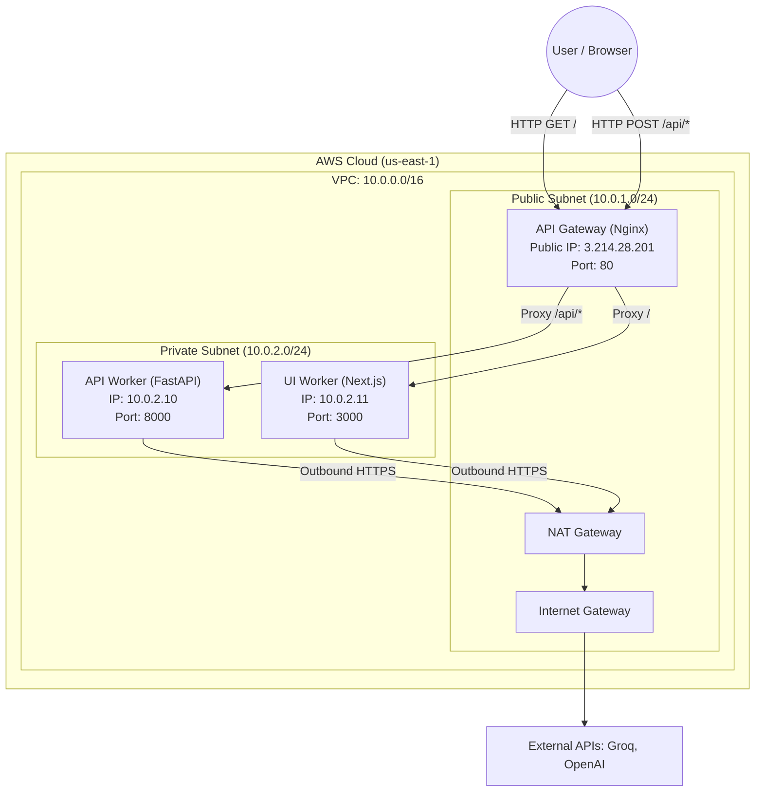
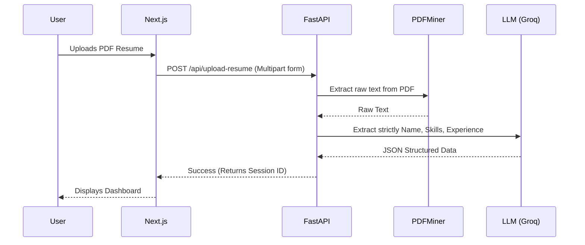
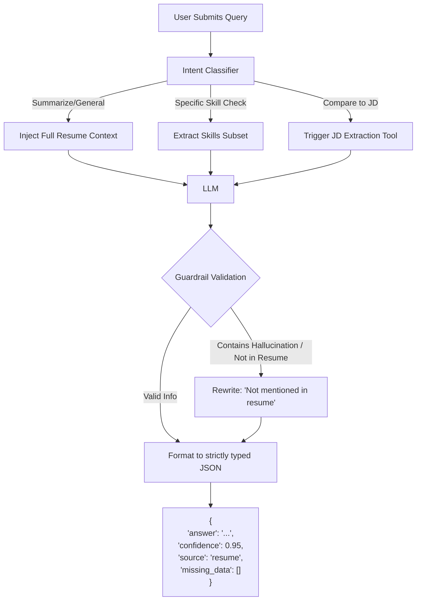
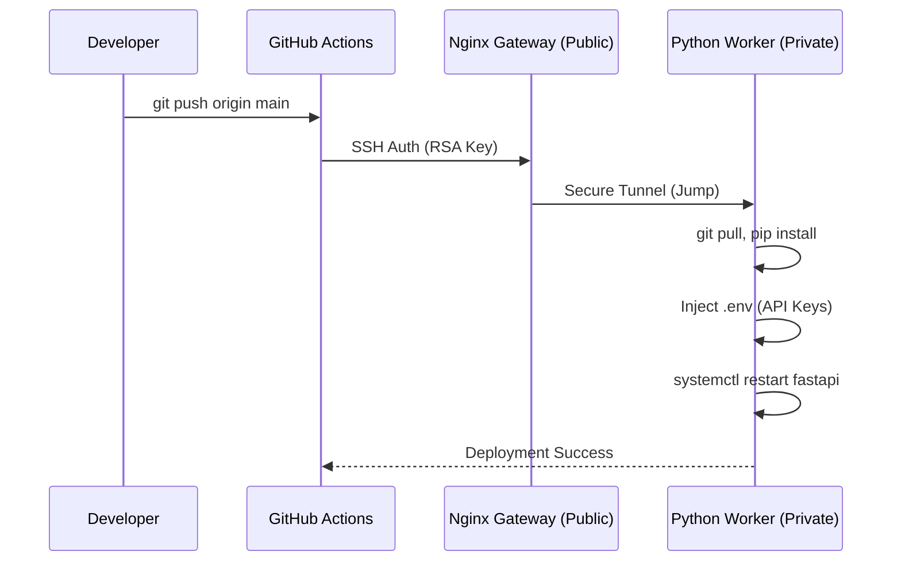

# ResumeAlchemyst: Engineering Design Report

## 1. Executive Summary
ResumeAlchemyst is a production-ready, agentic AI application designed for hiring teams. It bridges the gap between state-of-the-art GenAI capabilities (LLM-based resume extraction and querying) and enterprise-grade infrastructure. This report details the architectural decisions, data flows, and infrastructure scaling considerations that make this a robust, deployable product.

---

## 2. System Architecture & Infrastructure

The application is deployed entirely via **Infrastructure as Code (Terraform)** on AWS. To ensure strict security and isolation, the application is split across an API Gateway and isolated backend workers.

### 2.1 Security & Networking
*   **Zero Public Exposure:** The Python inference worker and the Next.js UI worker are heavily sandboxed in a **Private Subnet**. They possess no public IP addresses and cannot be reached from the internet, mitigating DDoS and direct access attacks.
*   **API Gateway:** A single Nginx reverse proxy sits in the public subnet. It handles request routing, rate limiting (future), and acts as the sole entry point to the application.
*   **Outbound Traffic:** Private workers route their outbound requests (e.g., reaching the Groq API) through a NAT Gateway.

---

## 3. Data Flow & Agentic Logic

ResumeAlchemyst is not a simple chatbot. It is an **Agentic System** that strictly enforces structured JSON outputs and adheres to rigid guardrails to prevent AI hallucinations.

### 3.1 Document Upload & Extraction Flow
When a recruiter uploads a PDF, the document is heavily parsed and cached in memory before the LLM is invoked.

### 3.2 Agentic Query Control Flow
When a user asks a question, the system employs an orchestration layer that evaluates intent, selects tools, and validates the output.

### 3.3 Strict Guardrails
To satisfy enterprise constraints, the system ensures:
1.  **Grounding:** The LLM's system prompt strictly instructs it to answer *only* using provided context. 
2.  **Structured Fallback:** If a candidate does not have a required skill, the LLM sets `"missing_data": ["skill_name"]` and reduces its `"confidence"` score, avoiding generative guessing.

---

## 4. Automated CI/CD Pipeline (Bastion Deployment)

To deploy updates without destroying the infrastructure, the project leverages GitHub Actions. Since the workers are in a private subnet, the pipeline utilizes the Nginx Gateway as an SSH Bastion Host (Jump Server).

---

## 5. Future Scalability (100x Growth)

To transition this architecture from a PoC to an enterprise scale (e.g., millions of resumes, 100x larger models like Llama-3-70B on self-hosted GPUs):

1.  **Container Orchestration:** Move away from raw EC2 instances (`systemd`) to **AWS ECS Fargate** or **Kubernetes (EKS)**. This removes the need for SSH deployments in favor of Immutable Docker Containers deployed via Elastic Container Registry (ECR).
2.  **GPU Acceleration:** Shift the Python Worker to `g5` or `p4` instances. 
3.  **Asynchronous Queues:** Synchronous HTTP requests will time out under heavy GPU load. We must introduce **AWS SQS** or **Redis**. The API Gateway will drop extraction jobs into a queue and immediately return a `202 Accepted` with a `job_id`. The Next.js frontend will poll for the result.
4.  **Vector Databases (RAG):** Instead of injecting the entire resume into the context window for every query, the resume will be chunked, embedded, and stored in a vector database (e.g., Pinecone or pgvector) to reduce token costs and improve speed on extremely long CVs.
